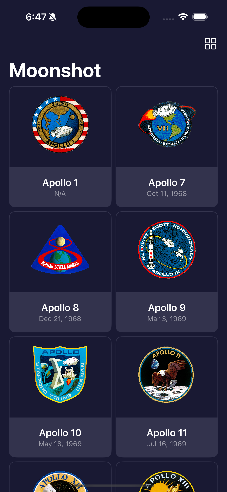
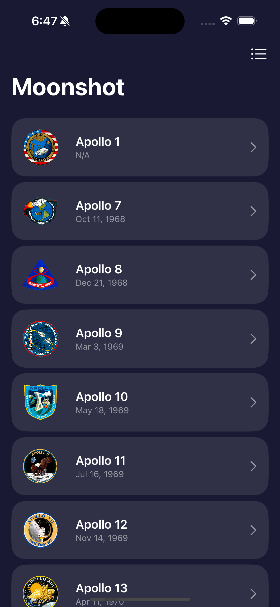
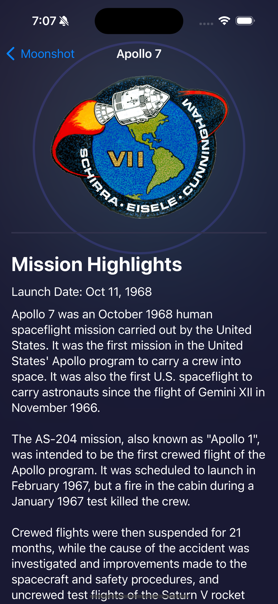
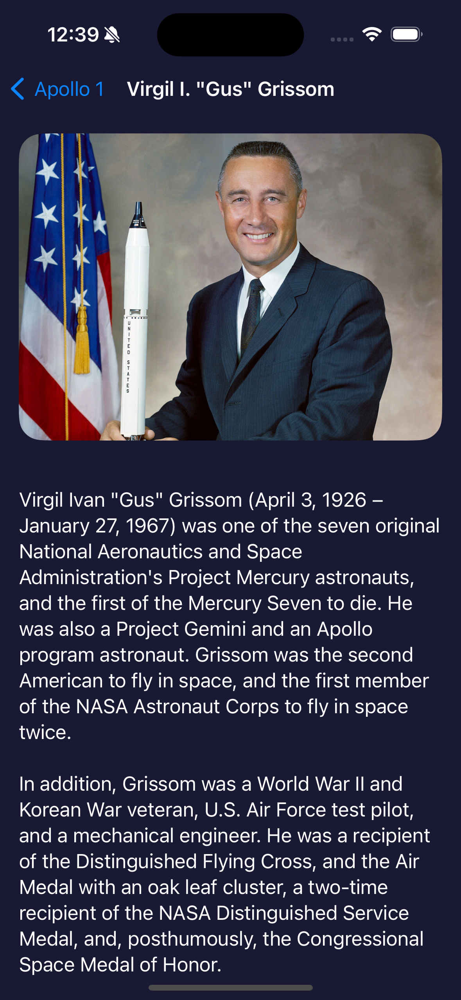

# Moonshot 🚀

Moonshot is an iOS application that explores NASA's Apollo space missions and the astronauts who made history. Built with SwiftUI, this app provides an interactive and engaging way to learn about space exploration history.

## App Preview

  

    
    
    
    
  

## Features

### Dynamic Mission Display
- **Grid/List View Toggle**: Seamlessly switch between grid and list layouts with smooth animations
- **Mission Cards**: Beautiful mission cards featuring mission patches and launch dates
- **Responsive Layout**: Adaptive grid system that works across different iOS devices

### Detailed Mission Information
- **Mission Details**: Comprehensive information about each Apollo mission
- **Crew Listings**: Interactive horizontal scrolling view of mission crew members
- **Launch Dates**: Formatted mission launch dates
- **Mission Highlights**: Detailed mission descriptions and key achievements

### Astronaut Profiles
- **Detailed Biographies**: In-depth information about each astronaut
- **Visual Elements**: Professional photographs with elegant visual effects
- **Role Information**: Details about each astronaut's role in their missions

### Visual Effects & Animations
- **Custom Animations**: Engaging animations for mission patches and images
- Smooth transitions between views
- Blur effects and scaling animations for visual interest
- Loading animations for content appearance

### UI/UX Features
- **Dark Mode**: Optimized dark theme for comfortable viewing
- **Navigation**: Intuitive NavigationStack-based navigation
- **Accessibility**: Clear typography and readable content layout
- **Responsive Design**: Adapts to different screen sizes and orientations

### SwiftUI Framework
- Built entirely with SwiftUI for modern iOS development
- Uses latest SwiftUI features including:
  - NavigationStack
  - Grid Layouts
  - Custom Animations
  - Container Relative Frames

### Data Management
- JSON data decoding for mission and astronaut information
- Custom decoding implementations for complex data structures
- Efficient data loading and caching mechanisms

### Architecture
- Clean separation of concerns between views
- Modular components for reusability
- Custom view components for consistent UI elements

### Performance
- LazyVGrid and LazyVStack for efficient scrolling
- Optimized image loading and caching
- Smooth animations and transitions

## Getting Started

1. Clone the repository
2. Open the project in Xcode
3. Build and run on iOS 15.0 or later

## Requirements
- iOS 15.0+
- Xcode 13.0+
- Swift 5.5+

## Acknowledgments
- NASA for the historical information and images
- SwiftUI framework by Apple
- Mission patch artwork from NASA archives

## License
This project is available under the MIT license. See the LICENSE file for more info.

## Author
Created by Wai Ho Fan
